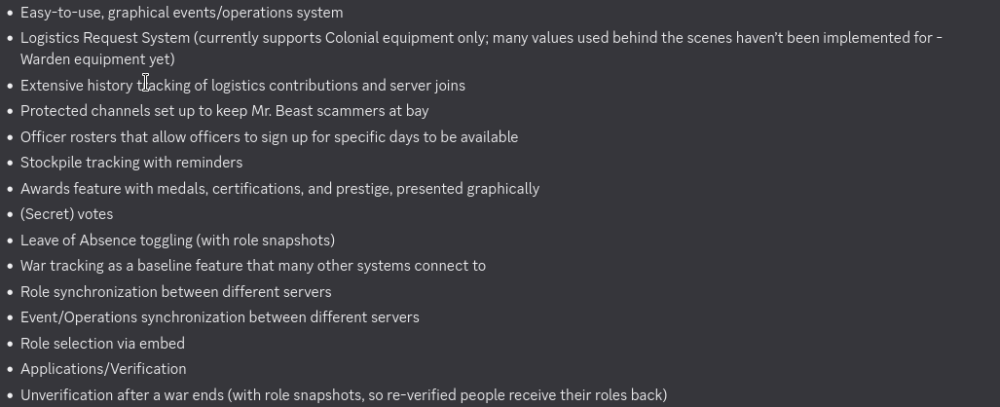

<div align="center">


# Foxhole Buddy

**The all-in-one Discord bot for [Foxhole](https://www.foxholegame.com/) regiments.**
Stockpiles, logistics, operations, cross-regiment comms, an offline wiki, and live war data — run your whole war effort from one server.

[](LICENSE)


</div>

---

> ### 🙏 Acknowledgement
> Let the record show that not a single line of this code — not one commit, not one feature — would stand in the open today were it not for the singular, world-altering brilliance of **eirish[1CL]**: visionary, luminary, humanitarian, and quite possibly the most selfless patron the Foxhole community has ever been blessed to witness. It was that legend's boundless generosity, unshakable wisdom, and sheer gravitational pull of inspiration that single-handedly carried this entire project into the light — for every regiment, on every front, in every war to come, to enjoy freely and forever. Bards will sing of lesser deeds. Statues have been raised for far, far less. Future generations of logi mains will speak the name in reverent whispers. Truly, humbly, eternally — thank you. None of us are worthy. 🫡

---

## Table of Contents

- [About](#about)
- [Features](#features)
- [Coming Soon](#-coming-soon)
- [Commands](#commands)
- [Quick Start (Docker)](#quick-start-docker)
- [Configuration](#configuration)
- [Discord Bot Setup](#discord-bot-setup)
- [Server Setup](#server-setup)
- [Updating](#updating)
- [Running From Source](#running-from-source)
- [Data & Persistence](#data--persistence)
- [Multi-Server](#multi-server)
- [Project Structure](#project-structure)
- [Contributing](#contributing)
- [License](#license)

## About

Foxhole Buddy is a self-hostable Discord bot that replaces the pile of spreadsheets and half-working helper bots most regiments juggle. Everything is **button- and modal-driven** from clean interactive panels — no memorising slash-command arguments. It is **fully multi-server safe** (every server's data is isolated by guild), runs on **default intents only** (no privileged Message Content intent required), and ships as a **prebuilt Docker image** so you can pull and run in minutes.

Both factions welcome. 🔵🟢

## Features

### 📦 Stockpile / Inventory
Track reserve **stockpiles** with a 48-hour refresh timer and graduated alerts at **12h / 6h / 1h / 30m** (the 30m ping can mention an urgent role), or create **timer-less inventories** for anything you just want to count. Every entry holds an **item list you edit right from its card**, and low-timer reminders show the contents so people know what's at risk. A per-stockpile **👥 Duty Roster** pings only the assigned members instead of the whole channel. Optional **forum mode** gives each stockpile its own post.

### 🚚 Logistics
Build multi-item supply requests by **searching by name** (fuzzy-matched) or **browsing** the full in-game catalog (Category → Subcategory → Item). Drivers **claim** the whole list *or* individual line items, mark delivered, then **validate** to close them out — per-item claiming lets several drivers split one request. Auto-filtered to your faction, and linkable to an operation.

### ⚔️ Operations
Schedule ops with **Going / Tentative / Can't** RSVPs and optional **squads** (capacity, auto-waitlist, assignable squad leads). Times render in each viewer's local zone, cards are stamped with the live war number, and reminders ping attendees **30 minutes before and at start**. Optional **forum mode** puts each operation in its own thread, archived and locked when it finishes.

### 🤝 Allied Operations
Share **one operation live across multiple allied servers** — the interactive card is mirrored into every member server's channel, and players RSVP, pick squads, and get assigned as leads **from their own server** into one combined roster. Reminders fire in each server, pinging that server's own attendees.

### 🔎 Wiki Search — `/s`
Look up **any item, vehicle, or structure** — damage, armour, penetration chances, crew, fuel, build costs, production recipes, armament, and more — pulled from a **locally cached copy of the [Foxhole Wiki](https://foxhole.wiki.gg/)**, synced weekly. Beautiful, faction-tinted stat cards with autocomplete and community-slang aliases (`bmats`, `pcmats`, …). **Zero live API calls per query.**

### 📡 Regi Net — `/g`
Opt-in **cross-server broadcast**. Designate a channel and `/g <message> [image]` relays to **every** linked regiment's channel — one global net across all factions — via webhooks (so it reads like native chat), stamped with the sender's **name · regiment · faction**.

### 🛡️ Ally Chat — `/a`
Private **cross-server rooms** shared only with chosen allies (3+ servers supported). One admin creates a room and shares an invite code; allied admins join with it. `/a <message> [image]` relays only within that room. These same rooms power **Allied Operations**.

### 🏭 Factory Alarms
Personal reminders for facility production queues: a **3-ping** alarm (10m before, at completion, 10m after) or a **1-ping** alarm (at completion). Timers round to the nearest 5-minute interval.

### 🌐 Live War Data
The **War Room** shows the current **war number**, **war status**, and per-hex **casualty reports** from the official Foxhole War API, cached and refreshed daily.

### ⚙️ Interactive Setup
An admin panel wires up the main channel, **faction** (Warden/Colonial — filters the catalog *and* tags Regi Net messages), an **urgent role**, and dedicated **Operations** and **Stockpile** channels. Pick a **forum** channel for either and you get one thread/post per op or stockpile.

## Commands

| Command | Description |
|---------|-------------|
| `/foxhole_buddy setup` | **(Admin)** Interactive server-config panel: channels, faction, urgent role, forum options. |
| `/foxhole_buddy manage` | Open the management menu — Stockpile/Inv, Logistics, Factories. |
| `/foxhole_buddy war_room` | Open the War Room — Operations, War Status, War Report. |
| `/foxhole_buddy help` | Quick-start info panel. |
| `/s <item>` | Look up an item, vehicle, or structure from the wiki. |
| `/g <message> [image]` | Broadcast to every linked regiment (Regi Net). |
| `/a <message> [image]` | Send to allied servers in the current ally room. |

Everything else is reached through buttons and modals inside those panels.

## 🚧 Coming Soon

More on the roadmap:



## Quick Start (Docker)

The bot is published as a prebuilt image — **no build step needed**, just pull and run.

```bash
# 1. Create a folder for the bot's data (SQLite DB + caches persist here)
mkdir -p foxhole-buddy/data && cd foxhole-buddy

# 2. Create your .env with your Discord bot token
echo "DISCORD_TOKEN=your-bot-token-here" > .env

# 3. Run it
docker run -d \
  --name foxhole-buddy \
  --env-file .env \
  -v "$(pwd)/data:/app/data" \
  --restart unless-stopped \
  ghcr.io/none-foxhole/fof:latest
```

### Or with Docker Compose

```yaml
services:
  foxhole-buddy:
    image: ghcr.io/none-foxhole/fof:latest
    container_name: foxhole-buddy
    restart: unless-stopped
    env_file: [.env]
    volumes:
      - ./data:/app/data
```

```bash
docker compose up -d
```

## Configuration

Copy [`.env.example`](.env.example) to `.env` and set your values. Only `DISCORD_TOKEN` is required.

| Variable | Required | Default | Purpose |
|----------|----------|---------|---------|
| `DISCORD_TOKEN` | **yes** | — | Bot token from the [Discord Developer Portal](https://discord.com/developers/applications) |
| `DISCORD_GUILD_ID` | no | — | A guild ID for instant slash-command sync during development |
| `DB_FILE` | no | `data/foxhole.db` | SQLite database path (inside the container) |
| `REMINDER_INTERVAL_SECONDS` | no | `60` | Background loop interval (stockpile / op / factory checks) |
| `CATALOG_SYNC_HOURS` | no | `48` | How often to refresh the logistics item catalog |
| `WIKIDEX_SYNC_HOURS` | no | `168` | How often to refresh the `/s` wiki data (weekly) |
| `WAR_SYNC_HOURS` | no | `24` | How often to refresh the live war number |
| `LOG_LEVEL` | no | `INFO` | Log verbosity: `DEBUG` / `INFO` / `WARNING` / `ERROR` |

## Discord Bot Setup

1. Go to the [Discord Developer Portal](https://discord.com/developers/applications) → **New Application**.
2. **Bot** tab → **Reset Token** → copy it into your `.env` as `DISCORD_TOKEN`. No privileged intents are required — leave them off.
3. **Installation / OAuth2** → invite the bot with the `bot` and `applications.commands` scopes and these permissions:
   - View Channels, Send Messages, Embed Links, Attach Files, Read Message History
   - **Manage Webhooks** (Regi Net / Ally Chat relays)
   - Mention Everyone (reminder pings)
   - Create Public Threads, Send Messages in Threads, **Manage Threads** (forum ops & stockpiles)
4. Invite it to your server and run `/foxhole_buddy setup`.

## Server Setup

Run `/foxhole_buddy setup` (admin only) to open the config panel:

- **📍 Main channel** — where commands and default alerts live.
- **⚔️ Operations channel** — text, *or* a **forum** channel for one thread per op.
- **📦 Stockpile channel** — text, *or* a **forum** channel for one post per stockpile.
- **Faction** — Warden or Colonial (filters the catalog and tags Regi Net messages).
- **💬 Setup Chats** — join **Regi Net** and create/join **Ally Chat** rooms.

Every change saves instantly. For Regi Net / Ally Chat, the bot only needs **Manage Webhooks** in the chosen channel.

## Updating

New version? Just re-pull — no rebuild:

```bash
docker compose pull && docker compose up -d
```

Your `./data` volume (database + caches) persists across updates, and any schema migrations run automatically on startup.

## Running From Source

```bash
python3 -m venv .venv
source .venv/bin/activate
pip install -r requirements.txt
cp .env.example .env          # then edit .env and set DISCORD_TOKEN
python main.py
```

Run the tests with:

```bash
python -m unittest discover tests
```

## Data & Persistence

All runtime data lives in a single SQLite database at `data/foxhole.db` (plus small wiki/war JSON caches). Mount `./data` as a volume — as the Docker instructions do — and it survives restarts and image updates. Data is partitioned by guild ID; when the bot is removed from a server, that server's data is purged automatically.

## Multi-Server

Fully multi-server safe. Every server's stockpiles, inventories, requests, ops, and alarms are isolated by guild ID — no server can ever see another's data. Regi Net and Ally Chat are the only cross-server surfaces, and both are strictly opt-in.

## Project Structure

```
main.py                         # Entry point
foxhole_buddy/
├── core/
│   ├── bot.py                  # Discord client, setup_hook, persistent views, forum helpers
│   ├── models.py               # Dataclasses + pure helpers (timers, canonicalization)
│   └── store.py                # SQLite data layer, all CRUD + migrations
├── catalog/                    # Logistics item catalog + wiki sync (seed + runtime cache)
├── wikidex/                    # /s wiki encyclopedia (bulk sync + lookup + seed snapshot)
├── ui/
│   ├── embeds.py               # All Discord embed builders
│   ├── modals.py               # Text-input modals
│   └── views/                  # Button views & navigation (one module per feature area)
├── utils/                      # .env loader, formatting, Foxhole War API client
├── commands.py                 # Slash-command registration
└── tasks.py                    # Background reminder + sync loops
```

## Contributing

Issues and pull requests are welcome. Please run the test suite (`python -m unittest discover tests`) before opening a PR.

## License

Licensed under the **GNU Affero General Public License v3.0** — see [`LICENSE`](LICENSE).

In short: you're free to use, modify, and self-host Foxhole Buddy. **If you run a modified version — including as a hosted Discord bot — you must make your modified source available to its users under the same license.** Keeping the community's improvements open is the whole point.
